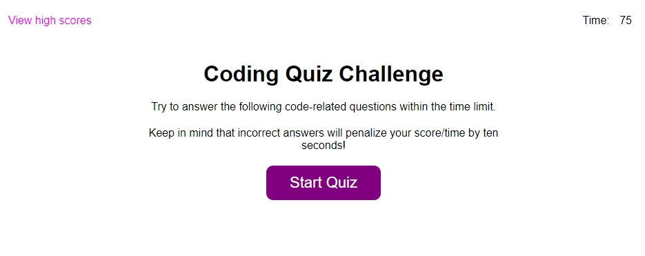

# Creation of Timed Quiz
## Table of Contents
- [Summary](#summary)
- [HTML Approach](#html-approach)
- [CSS Technologies](#css-technologies)
- [Javascript](#javascript)
- [Deployed Application](#deployed-application)
- [Screenshot](#screenshot)

## Summary
In this project, a timed Javascript quiz is presented to the user. The can take the quiz or view the high scores from previous attempts. Time is used as the score. Incorrect answers are penalized with a 10 second time reduction. The quiz ends when all questions have been answered or the time has run out.

## HTML Approach
- Templates used in code to provide HTML for the Javascript to switch the main screen to

## CSS Technologies
- Used CSS variables for primary and secondary colors for both text and buttons/actions
- Flexbox used for layouts in one direction
- Changed button color on hover
- Altered background colors on high score display
- Media queries used to appropriately alter elements for mobile resolutions
- View width (vw) used for most font sizes and width to be more reactive

## Javascript
- Loaded in divs on page to use as templates for different screens
- Event listeners created and reloaded on screen changes
- Stored and retrieved high scores in array of objects
- Questions, answers, and correct answers stored in Javascript object
- High score list is sorted by high scores descending, then alphabetically
- Queryselector used to find elements

## Deployed Application
- The web page can be found at [https://jesseparent.github.io/timed-quiz/](https://jesseparent.github.io/timed-quiz/)

## Screenshot
- The screenshot of the final work: 
